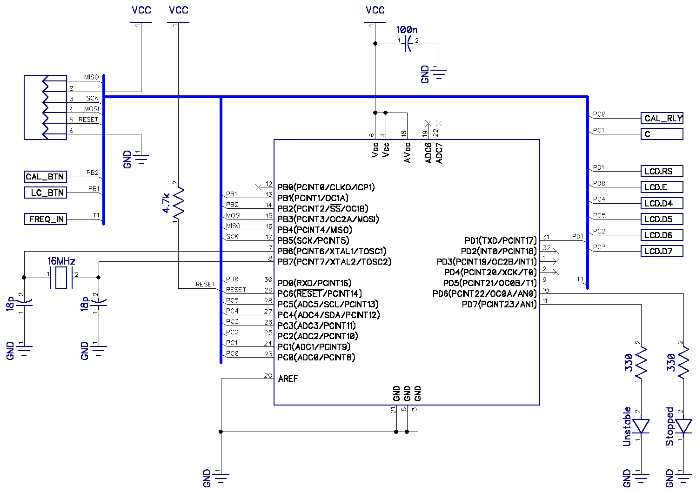

# LC Meter

This repository contains the schematics, PCB and firmware for a small inductance and capacitance meter I built in 2014

## Schematics

The schematics can be opened using DipTrace to find part numbers and other details.

### General Schematic

### Microcontroller Schematic

### Oscillator Schematic

## PCB

